# [Big Sleep](https://github.com/lucidrains/big-sleep) Examples 

Examples code and images for programmatically generating images using Big Sleep (CLIP + BigGAN).

Phrase ideas are welcome! Just create an issue or a pull request adding the desired phrase to `ideas.md`.

[Phrase Ideas](./ideas.md)

## In Progress

<!-- 

*The stars are a great mirror* -->

*Nothing happening right now*

## Best Images

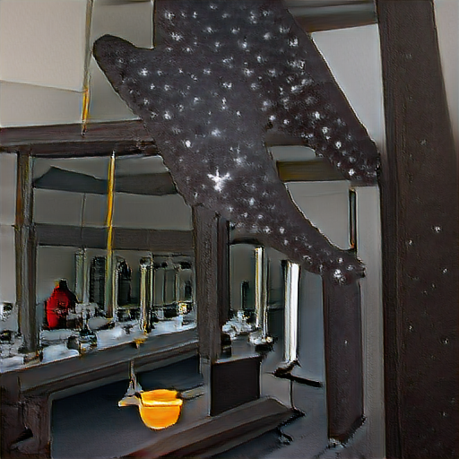

*The stars are a great mirror*

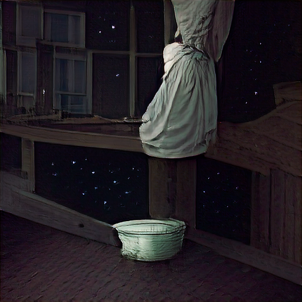

*What makes night within us may leave stars*

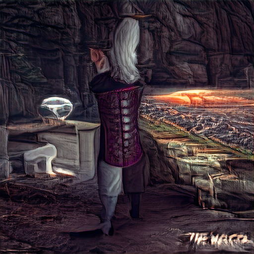

*The future is a place of magic*

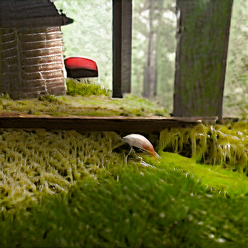

*Cabin in the woods with a moss lawn and little mushrooms*

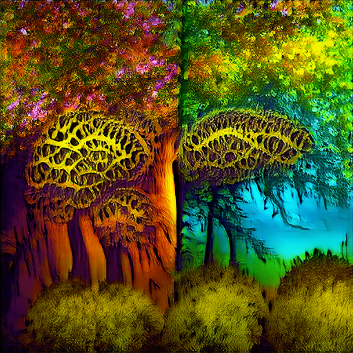

*Psychedelic fractal trees*

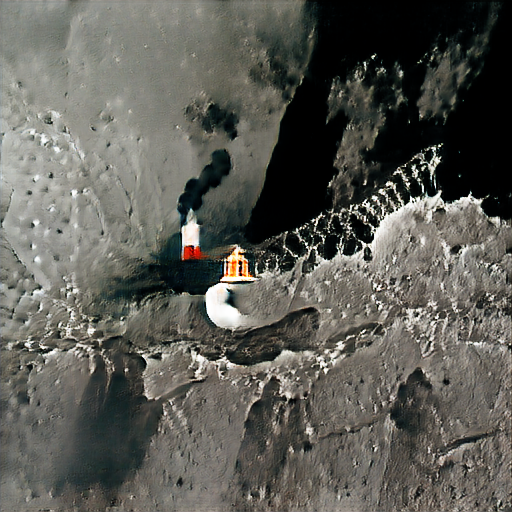

*A lighthouse on the moon*

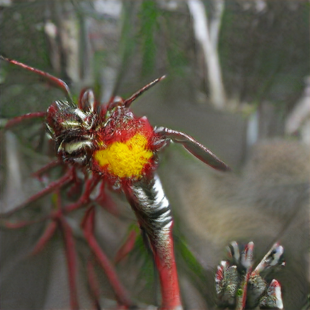

*Rambutan kangaroo paws on WASP-76b*

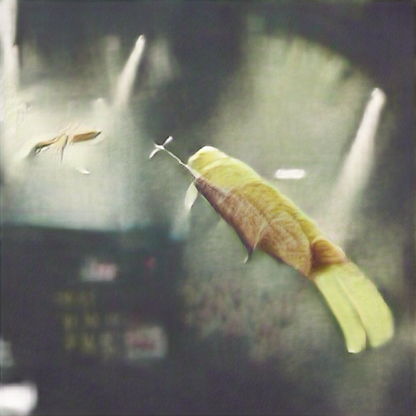

*Time flies like an arrow. Fruit flies like a banana.*

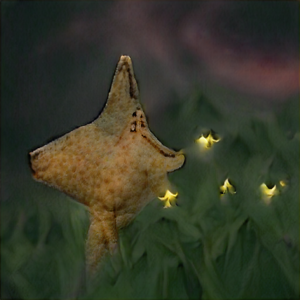

*The stars are looking forward and backward at you*

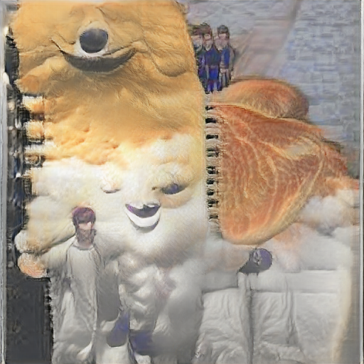

*Welcome to the DREAM journal, this is your first entry*

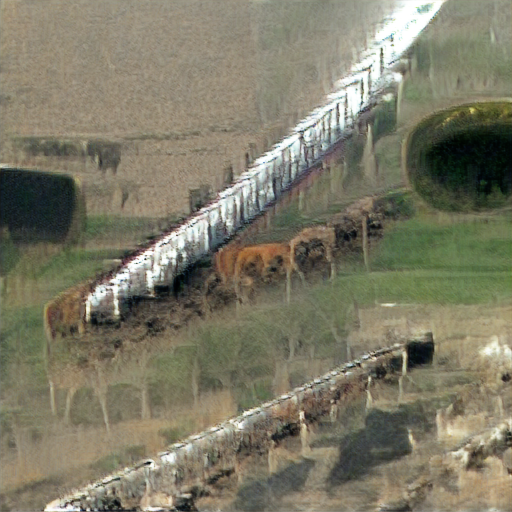

*A cattle filled train chugged along across farmland*

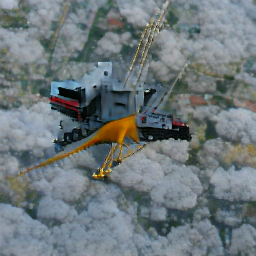

*Crane for moving clouds*

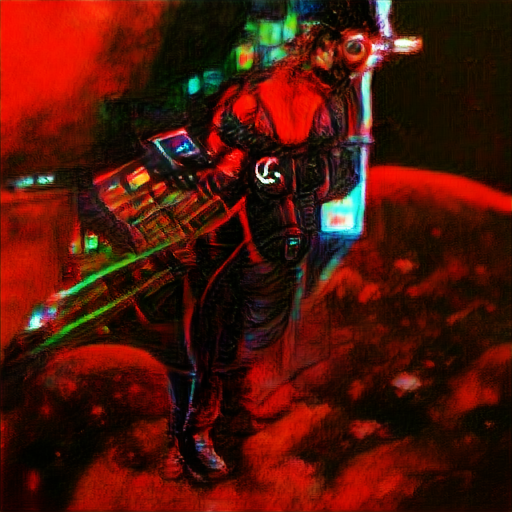

*cyberpunk communist in space*

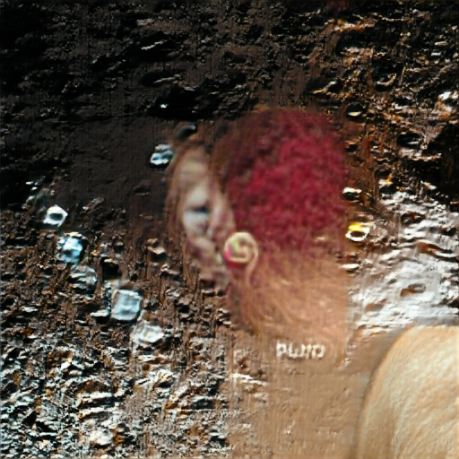

*Red head on pluto*

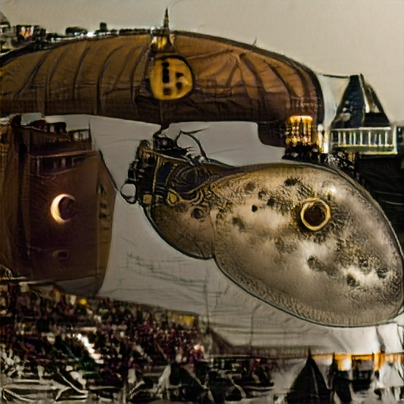

*Steampunk blimp over the moon*

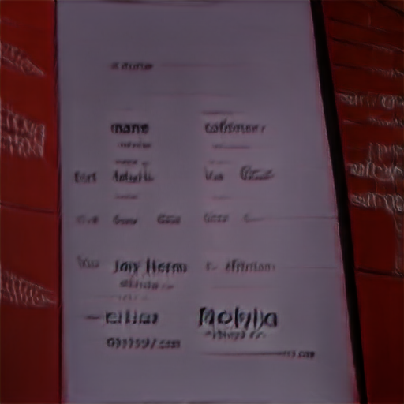

*How do I get my name?*

## Install

```sh
pip install -r requirements.txt
```

## Usage

Edit `dream.py` to change the text.

Then run:

```sh
python dream.py
```
