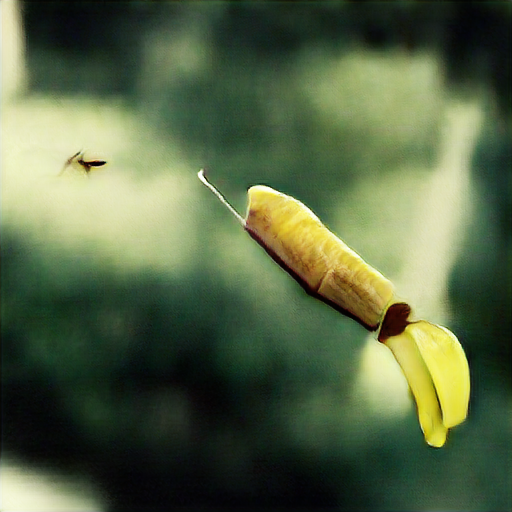

# [Big Sleep](https://github.com/lucidrains/big-sleep) Examples 

Examples code and images for programmatically generating images using Big Sleep (CLIP + BigGAN).

Phrase ideas are welcome! Just create an issue or a pull request adding the desired phrase to `ideas.md`.

[Phrase Ideas](./ideas.md)

## In Progress



*Time flies like an arrow. Fruit flies like a banana.*

<!-- *Nothing happening right now* -->

## Best Images


*The stars are looking forward and backward at you*


*Welcome to the DREAM journal, this is your first entry*


*A cattle filled train chugged along across farmland*


*Crane for moving clouds*


*cyberpunk communist in space*


*Red head on pluto*


*Steampunk blimp over the moon*


*How do I get my name?*

## Install

```sh
pip install big-sleep==0.8.5
```

## Usage

Edit `dream.py` to change the text.

Then run:

```sh
python dream.py
```
